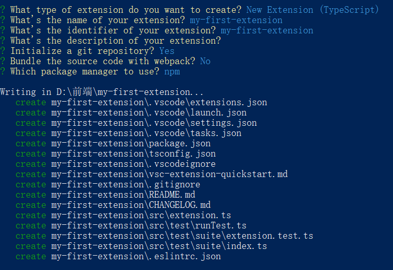

# VS Code 插件开发分享文档

## 1. 介绍
- 什么是 VS Code 插件
- 为什么要开发 VS Code 插件
- 插件的应用场景

## 2. 环境准备
- 安装 Node.js 和 npm
- 安装 Yeoman 和 VS Code 插件生成器
  ```bash
  npm install --global yo generator-code
  ```

## 3. 快速创建一个插件项目

### 使用 Yeoman 生成插件项目

```bash
yo code
```



### 目录结构


## 4. 插件开发基础

### 认识 VS Code 界面元素

大致可以分为两个主要概念: `Containers` 和 `Items`


- 活动栏 (Activity Bar)

​		活动栏是 VS Code 的一个核心导航界面。它位于 VS Code 窗口的左侧，包含一系列图标，每个图标代表一个不同的视图容器 (View Container)。这些视图容器可以在主侧边栏 (Primary Sidebar) 中渲染视图 (Views)。

- 主侧边栏 (Primary Sidebar) / 次要侧边栏 (Secondary Sidebar)

  [主侧边栏 (Primary Sidebar)](https://code.visualstudio.com/api/ux-guidelines/sidebars#primary-sidebar)呈现一个或多个[视图](https://code.visualstudio.com/api/ux-guidelines/views)。活动栏 (Activity Bar) 和 主侧边栏 (Primary Sidebar) 紧密耦合。点击活动栏 (Activity Bar) 图标项将打开主侧边栏 (Primary Sidebar)，其中将显示视图容器 (View Container) 关联的一个或多个 视图 (View)。例如：点击Explorer将打开主侧边栏 (Primary Sidebar)，其中可以看到 Folders、Npm Scripts 和 Outline 视图。

- 编辑区 (Editor)

- 面板 (Panel)

  [Panel](https://code.visualstudio.com/api/ux-guidelines/panel) 是另一个用于公开 View Container 的区域。默认情况下，可以在 Panel 中查看 Terminal、Problems 和 Output 等视图。

- 状态栏

  [状态栏 (Status Bar)](https://code.visualstudio.com/api/ux-guidelines/status-bar) 提供有关工作区和当前活动文件的上下文信息。它呈现两组 [Status Bar 项](https://code.visualstudio.com/api/ux-guidelines/status-bar#status-bar-items)。在左侧，[Status Bar Items](https://code.visualstudio.com/api/ux-guidelines/status-bar#status-bar-items) 的范围限定为整个 Workspace。在右侧，项的范围限定为活动文件

  ## [项目](https://code.visualstudio.com/api/ux-guidelines/overview#items)

比较重要的两个文件

- src/extension.ts

- package.json

  - activationEvents，通常为onStartupFinished或其它...

  - contributes，用于声明扩展向 VS Code 提供的功能和配置，以下是一些常见的 `contributes` 子字段及其作用

    - **`commands`**：定义扩展提供的命令，这些命令可以在命令面板中执行。

      ```json
      "contributes": {
        "commands": [
          {
            "command": "extension.sayHello",
            "title": "Say Hello"
          }
        ]
      }
      ```

    - **`menus`**：定义扩展在各种菜单（如编辑器上下文菜单、资源管理器上下文菜单等）中添加的命令。

      ```json
      "contributes": {
        "menus": {
          "editor/context": [
              {
                "command": "extension.sayHello",
                "when": "editorHasSelection",
                "group": "navigation"
              }
            ],
            "view/title": [
              {
                "command": "extension.sayHello",
                "when": "view == terminal",
                "group": "navigation"
              }
            ],
            "commandPalette": [
              {
                "command": "extension.sayHello",
                "when": "editorHasSelection"
              }
            ]
        }
      }
      ```

    - **`keybindings`**：定义扩展的快捷键绑定。

      ```json
      "contributes": {
        "keybindings": [
          {
            "command": "extension.sayHello",
            "key": "ctrl+shift+h",
            "when": "editorTextFocus"
          }
        ]
      }
      ```

    - **viewsContainers**：定义视图容器

      ```json
      "contributes": {
        "viewsContainers": {
          "activitybar": [
            {
              "id": "myExtensionViewContainer",
              "title": "My Extension",
              "icon": "resources/my-icon.svg"
            }
          ]
        }
      }
      ```

    - **views**：定义视图

      ```json
      "contributes": {
        "views": {
          "myExtensionViewContainer": [
            {
              "id": "myView",
              "name": "My View"
            }
          ]
        }
      }
      ```

      

​			

## 5. 插件功能扩展

## 6. 调试和测试

## 7. 发布插件

- 准备发布
  - 更新 package.json
  - 添加 README 和 CHANGELOG
- 发布到 Visual Studio Code Marketplace
  - 使用 vsce 工具
  - 发布流程